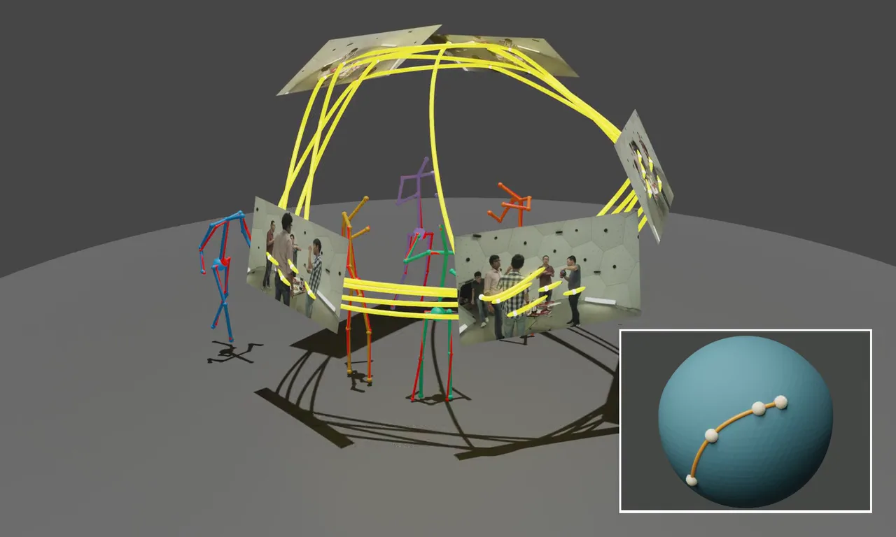

<h1 align="center">DisPOSE</h1>

<p align="center">
  <b>Projected Polystochastic Diffusion for<br>Self-Supervised Multi-View 3D Human Pose Estimation</b>
</p>

<p align="center">
  Tony Danjun Wang &nbsp;·&nbsp; Tolga Birdal &nbsp;·&nbsp; Nassir Navab &nbsp;·&nbsp; Lennart Bastian
</p>
<p align="center">
  <sub>Technical University of Munich &nbsp;·&nbsp; Munich Center for Machine Learning &nbsp;·&nbsp; Imperial College London</sub>
</p>

<p align="center">
  <a href="https://wngtn.github.io/DisPOSE/"></a>
  <a href="https://arxiv.org/pdf/2606.07419"></a>
  <a href="https://arxiv.org/abs/2606.07419"></a>
  <a href="#citation"></a>
</p>

<p align="center">
  
  
  
  <a href="LICENSE"></a>
</p>

<p align="center">
  
</p>

<p align="center">
  <sub><em>Diffusion over the space of polystochastic tensors progressively resolves noisy detections into clean, consistent multi-view 3D associations.</em></sub>
</p>

---

**DisPOSE** recasts the discrete cross-view person-assignment problem as a generative diffusion process on the space of **polystochastic tensors**, with differentiable **Sinkhorn projections** at every reverse step keeping each iterate on the feasible set. 
A **hypergraph convolutional decoder** then regresses full 3D skeletons across joints and camera views. 
Training needs no 3D ground truth, only 2D pseudo-labels from an off-the-shelf detector.

## Installation

> [!IMPORTANT]
> Tested with **Python 3.11** + **CUDA 12.8** + **PyTorch 2.7.1**.

```bash
# Package manager: uv (https://docs.astral.sh/uv/)
curl -LsSf https://astral.sh/uv/install.sh | sh
uv lock && uv sync

# Point the build system at the right CUDA toolkit
export CUDA_HOME=/usr/local/cuda-12.8
export PATH=/usr/local/cuda-12.8/bin:$PATH
unset TORCH_CUDA_ARCH_LIST

# Compile the deformable-attention CUDA op used by the hypergraph convolutional decoder
env -u TORCH_CUDA_ARCH_LIST .venv/bin/python src/external/ops/setup.py clean --all build install

# Install torch-scatter (scatter ops used by the hypergraph convolutions).
# Build for the GPU on this machine. If you build on a node without a visible
# GPU, set TORCH_CUDA_ARCH_LIST by hand instead (e.g. "8.0+PTX" for A100,
# "9.0+PTX" for H100, "12.0+PTX" for Blackwell).
ARCH=$(.venv/bin/python -c "import torch; print('{}.{}'.format(*torch.cuda.get_device_capability()))")
TORCH_CUDA_ARCH_LIST="${ARCH}+PTX" uv pip install --python .venv/bin/python --no-cache-dir --no-build-isolation --force-reinstall --no-binary=:all: torch-scatter==2.1.2
```

## Quickstart

Download the pretrained **weights** (four models, ~630 MB) and unzip them.

```bash
# Pretrained weights -> checkpoints/pose/<dataset>.pt
uvx gdown 1KjDpvcUIbWdfx1sC6jrzLf2IbtXsv2mk -O dispose_pose_weights.zip
unzip dispose_pose_weights.zip -d checkpoints/

# Evaluate (the checkpoint already contains the backbone, so backbone loading is disabled)
python src/eval.py dataset=shelf task=pose \
    ckpt_path=checkpoints/pose/shelf.pt \
    model.backbone.ckpt_path=null
```

`dataset` may be `panoptic`, `shelf`, `campus`, or `mm_or`; point `ckpt_path` at the matching `checkpoints/pose/<dataset>.pt`.
Evaluation needs the corresponding dataset on disk (see [Data](#data)) and a CUDA GPU.
Since publication, a fix to multi-GPU training raises Panoptic AP<sub>25</sub> by ~10%.

> [!NOTE]
> Training needs 2D pseudo-labels; see [Training](#training).

## Data

Evaluated on **CMU Panoptic**, **Shelf**, **Campus**, and **MM-OR Pose**, a benchmark we introduce that adds 3D pose annotations to the operating-room scenes of [MM-OR](https://github.com/egeozsoy/MM-OR).
Download CMU Panoptic (the other datasets come from their respective hosts):

```bash
bash preparation/data/panoptic/get_data.sh
```

> [!NOTE]
> **MM-OR Pose 3D annotations.** Our 3D-pose ground truth for the MM-OR evaluation
> sequences (`004_PKA`, `011_TKA`, `036_PKA`) is released separately. Get the base
> MM-OR dataset from [here](https://github.com/egeozsoy/MM-OR), then overlay our annotations onto it:
> ```bash
> uvx gdown 1s28d2BwULZHxlCVbEoF_H_q1i7sgizAL -O dispose_mm_or_annotations.zip
> unzip dispose_mm_or_annotations.zip -d data/   # -> data/mm_or/<sequence>/poses/<frame>.json
> ```
> Each `poses/<frame>.json` holds `[{"id", "keypoints_xyzs" (15×4), "label"}, ...]`; the
> MM-OR pose loader reads them from `data/mm_or/<sequence>/poses/`.

<details>
<summary><b>Expected directory layout</b></summary>

```text
data/
├── panoptic/
│   ├── <sequence>/
│   │   ├── hdImgs/
│   │   │   ├── 00_03/
│   │   │   ├── 00_06/
│   │   │   ├── 00_12/
│   │   │   ├── 00_13/
│   │   │   └── 00_23/
│   │   ├── hdPose3d_stage1_coco19/
│   │   └── calibration_<sequence>.json
│   └── ...
├── shelf/Camera{0..4}/
├── campus/Camera{0..2}/
└── mm_or/<take>/
    ├── colorimage/              # camera{01..05}_colorimage-*.jpg
    ├── camera{01..05}.json      # calibration
    └── poses/                   # our 3D-pose annotations (eval sequences)
```

</details>

## Training

Runs are configured by two axes, `dataset` and `task`, composed by Hydra:

```bash
python src/train.py dataset=<dataset> task=<task> task_name=<run_name>
```

`dataset` ∈ {`panoptic`, `shelf`, `campus`, `mm_or`} &nbsp;·&nbsp; `task` ∈ {`backbone`, `pose`}.

### 2D pseudo-labels

Training runs on weak 2D pseudo-labels (**not** needed for evaluation). Download our precomputed labels, or regenerate them yourself:

```bash
# Option A: download precomputed pseudo-labels (~140 MB) -> data/preparation/<dataset>/<timestamp>_train/
uvx gdown 1O8Un36ROUUGnLhYwbZ0OZ0TySj0YHaFR -O dispose_pseudo_labels.zip
unzip dispose_pseudo_labels.zip -d data/

# Option B: regenerate from scratch (RT-DETR + ViTPose -> cross-view ILP association -> anatomical rectification).
# One-time setup: install the COMPOSE association library (the `prep` extra).
GIT_LFS_SKIP_SMUDGE=1 uv pip install --no-deps "compose @ git+https://github.com/wngTn/COMPOSE.git"
python preparation/generate.py --dataset panoptic   # --dataset: panoptic|shelf|campus|mm_or; interval defaults per dataset (panoptic & mm_or 3, shelf/campus 1), override with --interval N
```

Regeneration writes the pickle to `data/preparation/<dataset>/<timestamp>_train/`; point the dataset config's `label_file:` at the new pickle file to use it.

> [!TIP]
> Pose training reads a frozen heatmap backbone from `checkpoints/backbone/<dataset>/pose_resnet50.pt`. You can fine-tune it (see *Heatmap-backbone fine-tuning* below) or, since the released pose checkpoints embed their backbone, extract one without retraining:
> ```bash
> python -c "import torch; sd=torch.load('checkpoints/pose/panoptic.pt')['state_dict']; torch.save({k[9:]:v for k,v in sd.items() if k.startswith('backbone.')}, 'checkpoints/backbone/panoptic/pose_resnet50.pt')"
> ```

Example pose run (Panoptic, 2 GPUs):

```bash
python src/train.py dataset=panoptic task=pose task_name=panoptic_pose trainer.devices=2 data.train_cfg.dataset.interval=3
```

<details>
<summary><b>Per-dataset pose commands &amp; key arguments</b></summary>

Stage I (projected polystochastic diffusion for cross-view assignment and 3D root regression) and Stage II (hypergraph convolutional decoder for full-body pose) are optimized jointly on a frozen heatmap backbone.

| argument | meaning |
|---|---|
| `dataset=<name>` | dataset to train on |
| `task=pose` | the joint Stage I + Stage II training stage |
| `task_name=<name>` | directory name under `logs/Pose/` for this run |
| `trainer.devices=2` | DDP across 2 GPUs |
| `data.train_cfg.dataset.interval=<N>` | sample every Nth frame from each sequence |
| `trainer.max_steps=<N>` | total optimizer steps |
| `model.scheduler.T_max=<N>` | cosine-anneal horizon (keep in sync with `max_steps`) |

```bash
# Panoptic (from scratch)
python src/train.py dataset=panoptic task=pose task_name=panoptic_pose trainer.devices=2 data.train_cfg.dataset.interval=3

# Shelf / Campus / MM-OR warm-start from the panoptic pose weights with the backbone
# stripped out. Create that file once from the panoptic pose checkpoint:
mkdir -p checkpoints/warmstart
python -c "import torch; c=torch.load('checkpoints/pose/panoptic.pt', map_location='cpu', weights_only=False); torch.save({'state_dict': {k: v for k, v in c['state_dict'].items() if not k.startswith('backbone.')}}, 'checkpoints/warmstart/panoptic_pose_no_backbone.pt')"

# Shelf
python src/train.py dataset=shelf task=pose task_name=shelf_pose trainer.devices=2 data.train_cfg.dataset.interval=1 trainer.max_steps=15000 model.scheduler.T_max=15000

# Campus
python src/train.py dataset=campus task=pose task_name=campus_pose trainer.devices=2 data.train_cfg.dataset.interval=1 trainer.max_steps=30000 model.scheduler.T_max=30000

# MM-OR Pose
python src/train.py dataset=mm_or task=pose task_name=mm_or_pose trainer.devices=2
```

> [!TIP]
> Common overrides: `trainer.devices=1 trainer.strategy=auto` for a single GPU, `trainer=debug` for a short dev run, and `ckpt_path=<path>.ckpt` to resume from a checkpoint.

</details>

<details>
<summary><b>Heatmap-backbone fine-tuning</b> (optional)</summary>

Trains the per-view feature backbone that produces the 2D joint heatmaps used by both stages of the pose model. Run this **before** pose training.

```bash
# Panoptic, from scratch
python src/train.py dataset=panoptic task=backbone task_name=panoptic_backbone model.backbone.ckpt_path=null

# Shelf / Campus / MM-OR Pose: fine-tune the panoptic backbone
python src/train.py dataset=shelf  task=backbone task_name=shelf_backbone
python src/train.py dataset=campus task=backbone task_name=campus_backbone
python src/train.py dataset=mm_or  task=backbone task_name=mm_or_backbone
```

When each run finishes, save the extracted heatmap weights to `checkpoints/backbone/<dataset>/pose_resnet50.pt`, which is the path pose training reads.

</details>

## Citation

```bibtex
@inproceedings{wang2026dispose,
  title     = {DisPOSE: Projected Polystochastic Diffusion for Self-Supervised Multi-View 3D Human Pose Estimation},
  author    = {Wang, Tony Danjun and Birdal, Tolga and Navab, Nassir and Bastian, Lennart},
  booktitle = {Proceedings of the 43rd International Conference on Machine Learning},
  series    = {Proceedings of Machine Learning Research},
  publisher = {PMLR},
  year      = {2026},
}
```

## License

Released under the [MIT License](LICENSE).
